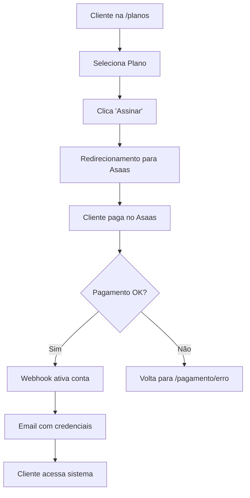

# 🔧 Integração Asaas - Torneira Digital

Guia completo para configurar a integração híbrida com Asaas para processar pagamentos.

## 📋 Visão Geral

Este sistema utiliza a **Solução Híbrida Asaas** que combina:
- Frontend customizado para seleção de planos
- Redirecionamento direto para checkout Asaas
- Webhook automático para ativação de contas
- Criação automática de usuários e assinaturas

## 🚀 Configuração Rápida

### 1. **Configurar Links de Pagamento no Asaas**

Acesse seu painel Asaas e crie os links de cobrança:

#### 🟢 Plano Mensal (R$ 89,90)
- **Valor**: R$ 89,90
- **Recorrência**: Mensal
- **Descrição**: Plano Mensal Torneira Digital

#### 🟡 Plano Semestral (R$ 79,90/mês)
- **Valor**: R$ 479,40
- **Recorrência**: Única (6 meses)
- **Descrição**: Plano Semestral Torneira Digital (6x R$ 79,90)

#### 🔵 Plano Anual (R$ 69,90/mês)
- **Valor**: R$ 838,80
- **Recorrência**: Única (12 meses)
- **Descrição**: Plano Anual Torneira Digital (12x R$ 69,90)

### 2. **Atualizar Links no Sistema**

Edite o arquivo `src/lib/asaas-links.ts`:

```typescript
export const ASAAS_LINKS: Record<string, AsaasLinkConfig> = {
  // 🟢 Plano Mensal
  'plano-mensal-torneira-digital': {
    url: 'https://www.asaas.com/c/SEU_LINK_MENSAL',
    nome: 'Plano Mensal',
    valor: 89.90,
    valor_total: 89.90,
    periodo: 'mensal',
    duracao_meses: 1,
    desconto_percentual: 0,
    cor: 'blue'
  },
  
  // 🟡 Plano Semestral  
  'plano-semestral-torneira-digital': {
    url: 'https://www.asaas.com/c/SEU_LINK_SEMESTRAL',
    nome: 'Plano Semestral',
    valor: 79.90,
    valor_total: 479.40,
    periodo: 'semestral',
    duracao_meses: 6,
    desconto_percentual: 11,
    economia: 59.40,
    cor: 'purple'
  },
  
  // 🔵 Plano Anual
  'plano-anual-torneira-digital': {
    url: 'https://www.asaas.com/c/SEU_LINK_ANUAL',
    nome: 'Plano Anual',
    valor: 69.90,
    valor_total: 838.80,
    periodo: 'anual',
    duracao_meses: 12,
    desconto_percentual: 22,
    economia: 109.20,
    cor: 'green'
  }
}
```

## 🔗 Configuração do Webhook (Já Configurado)

O webhook já está configurado e funcional em:
- **URL**: `https://www.torneira.digital/api/webhooks/asaas`
- **Eventos**: Todos os `PAYMENT_*`
- **Token**: Configurado via variável de ambiente

### Eventos Processados:
- ✅ `PAYMENT_CREATED` - Registra transação pendente
- ✅ `PAYMENT_RECEIVED` - Ativa conta do cliente
- ✅ `PAYMENT_CONFIRMED` - Confirma assinatura
- ✅ `PAYMENT_OVERDUE` - Suspende conta
- ✅ `PAYMENT_DELETED` - Cancela assinatura

## 🧪 Ambiente de Testes (Sandbox)

### Para testar com dados fictícios:

1. **Use o ambiente Sandbox do Asaas**
2. **Modifique APENAS o link mensal** para testes:

```typescript
// Para testes - substitua apenas esta linha:
url: 'https://sandbox.asaas.com/c/SEU_LINK_TESTE',
```

3. **Configure o webhook de teste**:
```
URL: https://www.torneira.digital/api/webhooks/asaas
Token: torneira_webhook_sandbox_2025
```

### 🎭 Dados de Teste

Use estes dados no Sandbox:

**CPF de Teste**: `11144477735`
**Email**: `teste@torneira.digital`
**Nome**: `Cliente Teste`

**Cartões de Teste**:
- Aprovado: `5162306219378829`
- Negado: `5162306219378837`

## 📊 Fluxo Completo



## 🔐 URLs de Retorno

Já configuradas no sistema:

- **Sucesso**: `https://www.torneira.digital/pagamento/sucesso`
- **Erro**: `https://www.torneira.digital/pagamento/erro`  
- **Pendente**: `https://www.torneira.digital/pagamento/pendente`

## 🚨 Troubleshooting

### Webhook não funciona?
1. Verifique se a URL está acessível
2. Confirme o token no Asaas
3. Verifique logs na Vercel
4. Teste com ferramenta como Postman

### Cliente não recebe email?
1. Verifique se o webhook foi chamado
2. Confirme dados na tabela `email_queue`
3. Configure provedor de email (Resend, SendGrid)
4. Verifique spam/lixo eletrônico

### Pagamento aprovado mas conta não ativou?
1. Verifique logs do webhook
2. Confirme se eventos `PAYMENT_*` estão marcados
3. Verifique se variáveis de ambiente estão corretas
4. Teste webhook manualmente

## 📞 Suporte Técnico

### Para desenvolvedores:

```bash
# Logs do webhook (Vercel)
vercel logs --follow

# Testar webhook localmente  
curl -X POST http://localhost:3000/api/webhooks/asaas \
  -H "Content-Type: application/json" \
  -d '{"event":"PAYMENT_CONFIRMED","payment":{"id":"test"}}'

# Verificar banco de dados
# Tabelas: usuarios, assinaturas, email_queue, asaas_webhook_logs
```

### Checklist de Deploy:

- [ ] Links do Asaas atualizados
- [ ] Variáveis de ambiente configuradas
- [ ] Webhook testado e funcionando
- [ ] URLs de retorno corretas
- [ ] Provedor de email configurado
- [ ] Testes em sandbox realizados

## 📧 Configuração de Email (Opcional)

Para enviar emails reais, configure um provedor:

### Exemplo com Resend:

```typescript
// No webhook (api/webhooks/asaas.ts)
const response = await fetch('https://api.resend.com/emails', {
  method: 'POST',
  headers: {
    'Authorization': `Bearer ${process.env.RESEND_API_KEY}`,
    'Content-Type': 'application/json',
  },
  body: JSON.stringify({
    from: 'Torneira Digital <contato@seudominio.com>',
    to: [usuario.email],
    subject: '🎉 Bem-vindo à Torneira Digital',
    html: emailHTML,
  }),
})
```

## 🔄 Atualizações Futuras

Para alterar valores ou adicionar novos planos:

1. Crie novo link no Asaas
2. Adicione em `asaas-links.ts`
3. Atualize componente `PlanosPage.tsx` se necessário
4. Teste o fluxo completo
5. Deploy para produção

---

**🎯 Com essa configuração, seu sistema estará 100% funcional para processar pagamentos via Asaas!**
