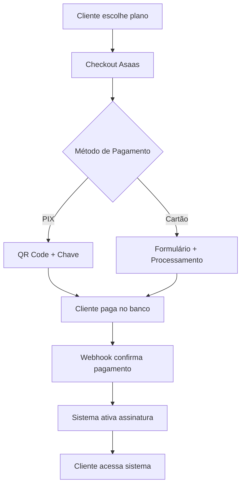

# 🚀 Setup Asaas - Sistema de Pagamentos

Este guia explica como configurar o gateway de pagamento Asaas no seu sistema Torneira Digital.

## 📋 **PASSO A PASSO COMPLETO**

### **1. 🏢 Criar Conta Asaas (5 minutos)**

1. **Acesse:** https://www.asaas.com
2. **Clique em "Criar conta grátis"**
3. **Preencha os dados:**
   - Nome completo
   - Email
   - CPF/CNPJ da empresa
   - Telefone
   - Senha segura
4. **Confirme o email** (verifique spam/lixo)
5. **Complete o cadastro da empresa:**
   - Razão social
   - Endereço completo
   - Atividade econômica
   - Conta bancária para recebimento

### **2. 🔑 Gerar API Key (2 minutos)**

1. **Acesse o Dashboard Asaas**
2. **Navegue:** Menu → **Integrações** → **API**
3. **Clique em "Gerar nova API Key"**
4. **Copie a chave gerada** (guarde com segurança!)
5. **Anote também a chave de sandbox** (para testes)

> ⚠️ **IMPORTANTE:** Nunca compartilhe suas API Keys!

### **3. ⚙️ Configurar Variáveis de Ambiente**

1. **Copie o arquivo de exemplo:**
   ```bash
   cp env.example .env
   ```

2. **Adicione suas chaves no `.env`:**
   ```env
   # Suas chaves Asaas
   NEXT_PUBLIC_ASAAS_SANDBOX_API_KEY=sua_chave_sandbox_aqui
   NEXT_PUBLIC_ASAAS_PRODUCTION_API_KEY=sua_chave_production_aqui
   ```

3. **No Vercel (produção), adicione as variáveis:**
   - Acesse: Vercel Dashboard → Seu Projeto → Settings → Environment Variables
   - Adicione: `NEXT_PUBLIC_ASAAS_PRODUCTION_API_KEY`

### **4. 🔔 Configurar Webhook (3 minutos)**

1. **No Dashboard Asaas:** Menu → **Integrações** → **Webhook**
2. **Clique em "Adicionar Webhook"**
3. **Configure:**
   - **URL:** `https://seudominio.vercel.app/api/webhooks/asaas`
   - **Eventos:** Selecione todos os eventos de "Payment"
   - **Ativo:** ✅ Sim
4. **Salve a configuração**

> 📝 **Para desenvolvimento local:** Use ngrok ou similar para expor localhost

### **5. 🧪 Testar no Sandbox (10 minutos)**

1. **Use dados de teste do Asaas:**
   ```
   PIX: Qualquer valor (será simulado)
   
   Cartão de Crédito (aprovado):
   - Número: 5162306219378829
   - Vencimento: 12/2030
   - CVV: 123
   - Nome: João da Silva
   
   Cartão de Crédito (recusado):
   - Número: 5162306219378837
   - Vencimento: 12/2030
   - CVV: 123
   ```

2. **Teste o fluxo completo:**
   - Selecione um plano
   - Preencha dados pessoais
   - Teste PIX (QR Code)
   - Teste cartão (aprovado e recusado)
   - Verifique webhooks no console

### **6. 🚀 Ir para Produção**

1. **Solicite aprovação da conta** (no dashboard Asaas)
2. **Aguarde liberação** (1-2 dias úteis)
3. **Altere ambiente para produção:**
   ```javascript
   // src/config/asaas.ts
   environment: 'production'
   ```
4. **Configure webhook de produção**
5. **Teste com valores baixos primeiro**

---

## 🎯 **COMO FUNCIONA**

### **Fluxo de Pagamento:**



### **Tabelas Criadas:**
- ✅ `assinaturas` - Controla planos ativos
- ✅ `transacoes_asaas` - Histórico de pagamentos
- ✅ `asaas_webhook_logs` - Logs para debug
- ✅ `configuracoes_asaas` - Configurações por usuário

### **Componentes Criados:**
- ✅ `CheckoutAsaas.tsx` - Interface de pagamento
- ✅ `asaas-service.ts` - Integração com API
- ✅ `subscription-service.ts` - Gestão de assinaturas
- ✅ `/api/webhooks/asaas.ts` - Recebe notificações

---

## 💰 **TAXAS ASAAS (2024)**

| Método | Taxa | Recebimento |
|--------|------|-------------|
| **PIX** | **0,95%** | D+0 (grátis) |
| **Débito** | **2,95%** | D+1 |
| **Crédito à vista** | **4,95%** | D+1 |
| **Crédito parcelado** | **5,95%** | D+30 |
| **Boleto** | **R$ 3,50** | D+2 |

> 💡 **Dica:** PIX tem a menor taxa e recebimento imediato!

---

## 🔧 **PERSONALIZAÇÃO**

### **Alterar dados da empresa:**
```javascript
// src/config/asaas.ts
company: {
  name: 'Sua Empresa',
  document: '00.000.000/0001-00', // Seu CNPJ
  email: 'contato@suaempresa.com',
  phone: '(11) 99999-9999'
}
```

### **Configurar métodos aceitos:**
```javascript
// src/config/asaas.ts
methods: {
  pix: true,
  creditCard: true,
  debitCard: true,
  bankSlip: false // Desabilitar boleto
}
```

### **Alterar limites:**
```javascript
// src/config/asaas.ts
limits: {
  minValue: 5.00,    // Valor mínimo
  maxValue: 10000.00, // Valor máximo
  maxInstallments: 6  // Máximo 6 parcelas
}
```

---

## 🛠️ **COMANDOS ÚTEIS**

### **Verificar configuração:**
```bash
# No console do navegador
console.log(getCurrentAsaasConfig())
```

### **Testar conexão:**
```bash
# No console do navegador
asaasService.testConnection().then(console.log)
```

### **Ver logs de webhook:**
```sql
-- No Supabase SQL Editor
SELECT * FROM asaas_webhook_logs 
ORDER BY created_at DESC 
LIMIT 10;
```

### **Verificar assinaturas:**
```sql
-- No Supabase SQL Editor
SELECT a.*, u.nome, p.nome as plano
FROM assinaturas a
JOIN usuarios u ON u.id = a.usuario_id
JOIN planos p ON p.id = a.plano_id
ORDER BY a.created_at DESC;
```

---

## 🆘 **TROUBLESHOOTING**

### **Webhook não está funcionando:**
1. Verifique a URL no dashboard Asaas
2. Confirme que os eventos estão selecionados
3. Teste com ngrok em desenvolvimento
4. Verifique logs: `asaas_webhook_logs`

### **Pagamento não confirma:**
1. Verifique se webhook está ativo
2. Confirme API Key correta
3. Teste em sandbox primeiro
4. Verifique logs de erro no console

### **Cartão recusado em sandbox:**
1. Use cartões de teste corretos
2. Verifique dados do portador
3. Confirme ambiente sandbox

### **Erro de CORS:**
1. Confirme variáveis de ambiente
2. Reinicie o servidor de desenvolvimento
3. Verifique se as chaves têm prefixo `NEXT_PUBLIC_`

---

## 📞 **SUPORTE**

### **Asaas:**
- 📧 Email: ajuda@asaas.com
- 💬 Chat: No dashboard Asaas
- 📚 Docs: https://docs.asaas.com

### **Sistema:**
- 🐛 Issues: GitHub do projeto
- 📧 Email: contato@torneiradigital.com

---

## ✅ **CHECKLIST FINAL**

- [ ] Conta Asaas criada e aprovada
- [ ] API Keys configuradas no `.env`
- [ ] Webhook configurado e testado
- [ ] Testes em sandbox funcionando
- [ ] Dados da empresa configurados
- [ ] Variáveis no Vercel configuradas
- [ ] Primeiro pagamento real testado
- [ ] Sistema de assinaturas funcionando

---

**🎉 Parabéns! Seu sistema de pagamentos está pronto!**

Agora seus clientes podem assinar os planos e pagar com PIX, cartão ou boleto de forma segura e automática.
